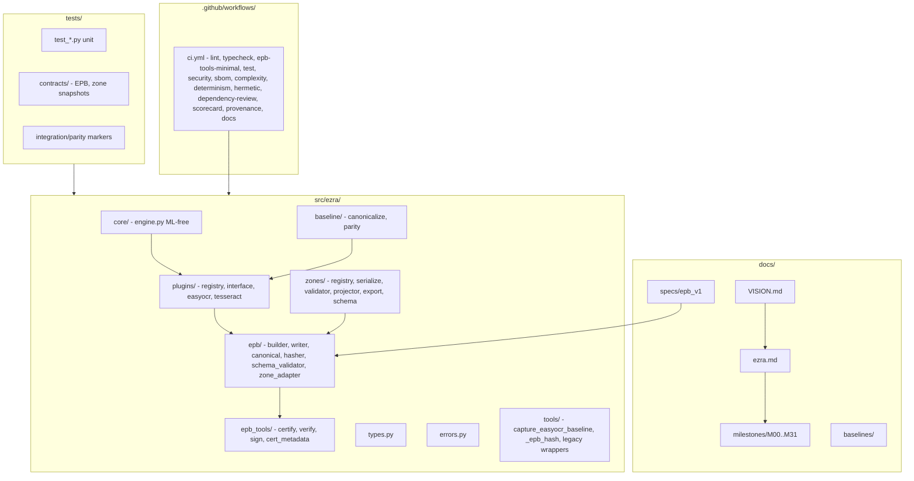

# EZRA Full Codebase Audit (M31 / v1.0.0)

**Auditor:** CodeAuditorGPT (CodebaseAuditPromptV2)  
**Repo:** EZRA (Extensible Zone-Based Runtime Architecture)  
**Commit:** `c3665a4a605b2b5b8ae1466784e43c8e1ad4c26c`  
**Snapshot:** Post–M31 (v1.0.0 Release Gate)  
**Primary language:** Python 3.11+  
**Build:** setuptools (pyproject.toml), mono-repo

---

## 1. Executive Summary

### Strengths

1. **Governance and invariants are first-class.** `docs/ezra.md` is the source of truth; `docs/VISION.md` defines architectural boundaries and non-goals. Milestone proof packs (plan, run, summary, audit, toolcalls) provide an audit trail. EPB schema, canonicalization, and hashing are locked and enforced in CI (`docs/ezra.md` §3, §7; `.github/workflows/ci.yml` schema governance, registry integrity, EPB contract/cert/signing steps).

2. **CI is truthful and non-mutating.** Lint uses `ruff check --no-fix` (no file rewrites in CI). Coverage gate is 85% with branch coverage; security (bandit, pip-audit, gitleaks), SBOM, complexity (radon), determinism, and hermetic reproducibility are required. Only Dependency Review and OpenSSF Scorecard use `continue-on-error: true`, and both are documented as infra/warn-first (`.github/workflows/ci.yml` lines 414–415, 434–435; 560, 596).

3. **Clear separation of concerns.** Core engine is ML-free; plugins (EasyOCR, Tesseract) sit behind `OCRPlugin`; EPB emission and EPB tools are isolated (`ezra.epb`, `ezra.epb_tools`). RediAI integration is artifact-boundary-only (`docs/ezra.md` §10).

### Biggest Opportunities

1. **No lockfile for production deps.** `pyproject.toml` pins `cryptography==46.0.5` but uses `jsonschema>=4.0`. Dev deps use ranges (e.g. `ruff>=0.1.0`). There is `requirements-dev.in` for pip-tools but no committed `requirements*.txt` or `uv.lock` for reproducible installs. **Recommendation:** Introduce a lockfile (e.g. `pip-compile` output or `uv lock`) and use it in CI for install step.

2. **3-tier test architecture not formalized.** Tests use markers (`integration`, `parity`) and default exclusions (`EZRA_RUN_PARITY=1`, `EZRA_RUN_INTEGRATION=1`), but CI runs a single test job with full suite + contract/schema/registry steps. There is no explicit Tier 1 (smoke) vs Tier 2 (quality) vs Tier 3 (nightly) split with separate thresholds. **Recommendation:** Document and optionally split into smoke (fast, low-threshold) and full (current) to speed PR feedback while keeping coverage discipline.

3. **Action pinning uses tags, not SHAs.** Workflows use `actions/checkout@v4`, `actions/setup-python@v5`, etc. Guardrail 10 prefers immutable revisions (SHA or exact version). **Recommendation:** Pin to full SHA for critical actions (checkout, setup-python, upload-artifact) to maximize reproducibility and security.

### Overall Score and Heatmap

| Area               | Score (0–5) | Weight | Notes |
|--------------------|-------------|--------|--------|
| Architecture       | 5           | 20%    | VISION/ezra.md enforced; core/plugin/EPB boundaries clear |
| Modularity/Coupling| 5           | 15%    | Plugin registry, EPB tools namespace, artifact-only RediAI |
| Code Health        | 4           | 10%    | Ruff, mypy, pydocstyle; minor: no lockfile |
| Tests & CI          | 5           | 15%    | 253 passed, 28 skipped, 85% gate; determinism/hermetic gates |
| Security & Supply  | 5           | 15%    | Bandit, pip-audit, gitleaks, SBOM, provenance; SECURITY.md |
| Performance        | 4           | 10%    | Not a stated goal; no SLOs; acceptable for V1 |
| DX                  | 4           | 10%    | Good quickstart; pre-commit; toolcalls/recovery rules |
| Docs                | 5           | 5%     | VISION, ezra.md, milestones, specs, SECURITY.md, qa |
| **Overall weighted**| **4.75**    | 100%   | Enterprise-certified v1.0.0 posture |

---

## 2. Codebase Map



**Drift vs intended architecture:** None observed. Layout matches `docs/ezra.md` §4 (core, plugins, baseline, tools, types) and VISION (core ML-free, plugins behind interface, EPB as output). `ezra.epb_tools` physical isolation (M28) is reflected; legacy wrappers in `tools/` deprecated.

---

## 3. Modularity & Coupling

**Score: 5 / 5**

### Top Couplings (low risk)

1. **`core/engine.py` → `ezra.epb` (build_epb_bundle, write_epb_bundle)**  
   **Evidence:** `src/ezra/core/engine.py:56-57` — late import to avoid circular deps.  
   **Impact:** Engine remains the single place that triggers EPB emission; EPB is not imported at engine load time.  
   **Interpretation:** Appropriate dependency inversion; no surgical decoupling needed.

2. **`plugins/registry.py` → `ezra.plugins.*` (lazy module path)**  
   **Evidence:** `src/ezra/plugins/registry.py:17-20` — registry maps names to `"module:Class"`; resolution via `import_module`.  
   **Impact:** Adding a plugin only requires one new registry entry and a new module; no core changes.  
   **Interpretation:** Stable extension point; no change recommended.

3. **`epb/zone_adapter.py` → `ezra.zones`**  
   **Evidence:** Zone adapter gates optional `zones.json` emission; zones are a separate subsystem.  
   **Impact:** EPB and zones are coupled only at adapter boundary; zones can evolve independently.  
   **Interpretation:** Aligns with artifact-boundary and adapter-gated design.

No tight, undesirable coupling identified. Plugin-first and artifact-boundary rules are respected.

---

## 4. Code Quality & Health

**Score: 4 / 5**

### Observations

- **Ruff:** `E, F, I, N, W, UP`; line-length 100; `--no-fix` in CI (`pyproject.toml:49-57`, `.github/workflows/ci.yml:27`).
- **Mypy:** Strict; `disallow_untyped_defs`, `check_untyped_defs`; overrides for easyocr/numpy/torch (`pyproject.toml:59-76`).
- **Pydocstyle:** Google convention; run on `src/` in CI (`pyproject.toml:104-110`, `.github/workflows/ci.yml:30`).
- **Radon:** Complexity gate grade C minimum; fails CI if worse than C (`.github/workflows/ci.yml:348-354`).

### Anti-patterns

- **Optional lockfile:** Production install is not fully reproducible (no committed lockfile). **Recommendation:** Add `pip-compile` (or equivalent) output or `uv.lock` and use in CI install step.
- **Pre-commit mypy vs CI:** Pre-commit uses `--strict --ignore-missing-imports` and `types-all`; CI runs `mypy src/` with project config. Slight divergence; acceptable if CI is source of truth.

### Before/After (example)

**Before (hypothetical):** No branch coverage in CI, only line coverage.  
**After (current):** `[tool.coverage.run] branch = true` and `fail_under = 85` with branch reporting in CI (`pyproject.toml:89-101`, `.github/workflows/ci.yml:82-83`).  
No 15-line code fix required; current state is already healthy.

---

## 5. Docs & Knowledge

**Score: 5 / 5**

### Onboarding path

1. Read `docs/VISION.md` for architecture and non-goals.
2. Read `docs/ezra.md` for layout, invariants, milestones, plugin policy, RediAI separation, quickstart.
3. Run: `pip install -e ".[dev]"` then `ruff check . && ruff format --check . && mypy src && pytest` (`docs/ezra.md` §8).
4. Optional: `pip install -e ".[easyocr]"` and baseline capture tool.

### Single biggest doc gap

**Observation:** New contributors might not know that parity/integration tests are skipped by default and require `EZRA_RUN_PARITY=1` / `EZRA_RUN_INTEGRATION=1`.  
**Recommendation:** Add one sentence to §8 in `docs/ezra.md`: “Parity and integration tests are skipped unless `EZRA_RUN_PARITY=1` or `EZRA_RUN_INTEGRATION=1` is set.”

---

## 6. Tests & CI/CD Hygiene

**Score: 5 / 5**

### Coverage

- **Tool:** pytest-cov, coverage[toml].
- **Scope:** `src`; omit `*/tests/*`, `*/__init__.py`, `*/tools/*` (`pyproject.toml:89-96`).
- **Threshold:** `fail_under = 85` (lines); branch coverage enabled.
- **Local run:** 253 passed, 28 skipped (ML/optional deps); CI Run 22509645140 (M31) green.

### Flakiness

- No evidence of flaky tests; determinism gate runs N≥3 runs and compares bundle hashes (`scripts/check_determinism.py`, `.github/workflows/ci.yml` determinism-check job).

### Test pyramid and 3-tier assessment

- **Current:** One main test job runs full suite plus contract/schema/registry/EPB steps. Markers: `integration`, `parity` (deselected by default).
- **3-tier:** Not formally split. Tier 1 (smoke) could be a small subset (e.g. `tests/test_smoke.py` + a few contract tests); Tier 2 = current suite; Tier 3 = nightly/comprehensive (e.g. parity + integration when env permits). **Recommendation:** Document desired tiers in a “CI Architecture” doc and optionally add a fast smoke job (e.g. `pytest tests/test_smoke.py tests/contracts/test_epb_contract.py -q`) as required, with rest remaining as today.

### Required checks, caches, artifacts

- **Required:** Lint, Type Check, EPB Tools Minimal Environment, Test (with coverage, schema governance, registry integrity, EPB contract/cert/signing/cert_metadata), Security, SBOM, Complexity, Determinism, Hermetic Hash matrix, Hermetic Reproducibility.
- **Caches:** `cache: "pip"` on setup-python steps.
- **Artifacts:** coverage-xml, zone-schema, security-artifacts, sbom, radon-artifacts, determinism-artifacts, hermetic-hash per Python version; uploads use `if: always()` where appropriate so evidence is kept on failure.

---

## 7. Security & Supply Chain

**Score: 5 / 5**

### Secret hygiene

- Gitleaks full-repo scan in CI; `continue-on-error: false`; SARIF uploaded (`ci.yml` security job, 252-263).

### Dependency risk and pinning

- **Production:** `cryptography==46.0.5` pinned; `jsonschema>=4.0` (minor range). pip-audit runs in CI and fails on vulnerabilities.
- **Gap:** No lockfile for full transitive set (see §4).

### SBOM and CI trust boundaries

- CycloneDX SBOM via `cyclonedx-py environment`; uploaded as artifact (`ci.yml` sbom job). SLSA Provenance on push to main/tags (`ci.yml` provenance job). Dependency Review (PR) and OpenSSF Scorecard are warn-first (documented).

---

## 8. Performance & Scalability

**Score: 4 / 5**

VISION and ezra.md state that performance is not the primary goal; correctness, determinism, and modularity are. No SLOs (e.g. P95 latency) are defined.

### Hot paths

- EPB build/write and hashing are in the main pipeline; they are deterministic and tested. No N+1 or obvious IO bottlenecks in the described scope.

### Concrete profiling plan

- If performance becomes a concern: (1) Add a small benchmark (e.g. pytest-benchmark or a dedicated script) for EPB build + write on a fixed payload. (2) Profile with `py-spy` or `cProfile` on that path. (3) Set an SLO (e.g. “EPB emission &lt; X ms for Y detections”) and add a non-blocking CI job or nightly check.

---

## 9. Developer Experience (DX)

**Score: 4 / 5**

### 15-minute new-dev journey

1. Clone; create venv (Python 3.11+).
2. `pip install -e ".[dev]"`.
3. Run: `ruff check . && ruff format --check . && mypy src && pytest`.
4. Read `docs/ezra.md` §8 and §9.

**Blockers:** None if Python 3.11+ and pip are available. Optional: `.[easyocr]` for full plugin tests (some skipped otherwise).

### 5-minute single-file change

1. Edit file; run `ruff check path && ruff format path && mypy src`.
2. Run `pytest tests/...` for affected area.
3. Pre-commit runs on commit.

**Blockers:** Pre-commit mypy can be slower on full `src/`; acceptable.

### Three immediate wins

1. Add the one-sentence note on parity/integration env vars to `docs/ezra.md` §8.
2. Add a lockfile and use it in CI for reproducible installs.
3. Pin critical GitHub Actions to full SHA in `.github/workflows/ci.yml`.

---

## 10. Refactor Strategy (Two Options)

### Option A: Iterative (phased PRs, low blast radius)

- **Rationale:** Codebase is already in good shape post-M31; improvements are incremental.
- **Goals:** Lockfile, action SHA pinning, doc tweak, optional smoke tier.
- **Migration steps:** (1) PR: Add lockfile and CI install from it. (2) PR: Pin actions to SHA. (3) PR: Doc update for parity/integration. (4) Optional PR: Add smoke job and document 3-tier intent.
- **Risks:** Low; no behavioral or schema changes.
- **Rollback:** Revert each PR independently.
- **Tools:** pip-tools or uv, GitHub action SHAs from official repos.

### Option B: Strategic (structural)

- **Rationale:** Not required for current state; would apply if expanding to multiple runtimes or products.
- **Goals:** Formal 3-tier CI with separate jobs and thresholds, optional packaging split (e.g. `ezra-core` vs `ezra-epb-tools`).
- **Migration steps:** Design in a milestone; implement in phases with governance updates in `docs/ezra.md`.
- **Risks:** Higher; touches CI and possibly packaging.
- **Rollback:** Feature flags or branch-based rollout.
- **Tools:** Same as above; ADR for 3-tier and packaging.

**Recommendation:** Prefer **Option A** for the next 1–2 sprints; Option B only if roadmap demands it.

---

## 11. Future-Proofing & Risk Register

| Risk | Likelihood | Impact | Mitigation |
|------|------------|--------|------------|
| Dependency breakage (no lockfile) | Medium | Medium | Introduce lockfile and use in CI |
| Action supply-chain compromise | Low | High | Pin actions to SHA |
| EPB schema drift | Low | High | Governance + schema snapshot + CI (already in place) |
| Hermetic hash divergence across Python | Low | High | Matrix + reproducibility job (already in place) |
| Flaky determinism check | Low | Medium | Keep N≥3 runs; alert on env changes |

### ADRs to lock decisions

- **EPB schema stability:** Already locked in `docs/ezra.md` and EPB spec; no new ADR needed.
- **RediAI artifact-boundary-only:** Documented in ezra.md §10; optional ADR if multiple consumers appear.
- **3-tier CI:** Add ADR or “CI Architecture” doc when/if formalizing tiers.

---

## 12. Phased Plan & Small Milestones (PR-Sized)

Each milestone is ≤60 minutes of engineering time and mergeable as its own PR.

### Phase 0 — Fix-First & Stabilize (0–1 day)

| ID | Milestone | Category | Acceptance Criteria | Risk | Rollback | Est | Owner |
|----|-----------|----------|---------------------|------|----------|-----|-------|
| P0-1 | Add lockfile (pip-compile or uv) and use in CI install | CI/Deps | Lockfile committed; CI install uses it; tests pass | Low | Remove lockfile, revert CI step | 1h | Dev |
| P0-2 | Pin critical GitHub Actions to full SHA (checkout, setup-python, upload-artifact) | Security/Repro | Workflow uses SHA refs; CI green | Low | Revert to @v4/@v5 | 0.5h | Dev |

### Phase 1 — Document & Guardrail (1–3 days)

| ID | Milestone | Category | Acceptance Criteria | Risk | Rollback | Est | Owner |
|----|-----------|----------|---------------------|------|----------|-----|-------|
| P1-1 | Document parity/integration env vars in docs/ezra.md §8 | Docs | One sentence added; review approved | Low | Revert edit | 0.25h | Dev |
| P1-2 | Add “CI Architecture” doc (current tiers + optional smoke) | Docs | Doc in docs/; no CI change yet | Low | Delete doc | 0.5h | Dev |
| P1-3 | Pin remaining actions (download-artifact, gitleaks, etc.) to SHA or exact tag | Security | All actions pinned; CI green | Low | Revert | 0.5h | Dev |

### Phase 2 — Harden & Enforce (3–7 days)

| ID | Milestone | Category | Acceptance Criteria | Risk | Rollback | Est | Owner |
|----|-----------|----------|---------------------|------|----------|-----|-------|
| P2-1 | Optional: Add smoke job (e.g. smoke + 2 contract tests) as required; keep coverage threshold in main job | CI | Smoke job &lt;2 min; required; main job unchanged | Low | Remove smoke job | 1h | Dev |
| P2-2 | Ensure coverage margin: if baseline &gt;87%, set fail_under to 85% (already true) | CI | No false failures on minor shifts | Low | N/A | 0h | N/A |

### Phase 3 — Improve & Scale (weekly cadence)

| ID | Milestone | Category | Acceptance Criteria | Risk | Rollback | Est | Owner |
|----|-----------|----------|---------------------|------|----------|-----|-------|
| P3-1 | If SLOs added later: define P95 target and add non-blocking perf job or nightly | Perf | SLO doc; optional job | Low | Remove job | 2h | Dev |
| P3-2 | Re-evaluate Dependency Review / Scorecard: enable as blocking if Advanced Security enabled | Security | Config change; documented | Low | Revert to continue-on-error | 0.5h | Dev |

---

## 13. Machine-Readable Appendix (JSON)

```json
{
  "issues": [
    {
      "id": "DEPS-001",
      "title": "Introduce lockfile for reproducible installs",
      "category": "supply_chain",
      "path": "pyproject.toml",
      "severity": "medium",
      "priority": "high",
      "effort": "low",
      "impact": 3,
      "confidence": 0.9,
      "ice": 2.7,
      "evidence": "pyproject.toml has jsonschema>=4.0 and only cryptography pinned; no requirements*.txt or uv.lock",
      "fix_hint": "Add pip-compile output or uv.lock; in CI: pip install -r requirements.txt or uv sync"
    },
    {
      "id": "CI-001",
      "title": "Pin GitHub Actions to full SHA",
      "category": "security",
      "path": ".github/workflows/ci.yml",
      "severity": "low",
      "priority": "medium",
      "effort": "low",
      "impact": 2,
      "confidence": 0.95,
      "ice": 1.9,
      "evidence": "uses: actions/checkout@v4, actions/setup-python@v5 (tags, not SHA)",
      "fix_hint": "Replace with e.g. actions/checkout@<full-sha> for checkout, setup-python, upload-artifact"
    },
    {
      "id": "DOC-001",
      "title": "Document parity/integration test env vars in quickstart",
      "category": "docs",
      "path": "docs/ezra.md",
      "severity": "low",
      "priority": "medium",
      "effort": "low",
      "impact": 1,
      "confidence": 0.9,
      "ice": 0.9,
      "evidence": "§8 does not mention EZRA_RUN_PARITY=1 or EZRA_RUN_INTEGRATION=1",
      "fix_hint": "Add one sentence in §8: parity and integration tests skip unless env vars set"
    }
  ],
  "scores": {
    "architecture": 5,
    "modularity": 5,
    "code_health": 4,
    "tests_ci": 5,
    "security": 5,
    "performance": 4,
    "dx": 4,
    "docs": 5,
    "overall_weighted": 4.75
  },
  "phases": [
    {
      "name": "Phase 0 — Fix-First & Stabilize",
      "milestones": [
        {
          "id": "P0-1",
          "milestone": "Add lockfile and use in CI install",
          "acceptance": ["lockfile committed", "CI install uses lockfile", "tests pass"],
          "risk": "low",
          "rollback": "revert lockfile and CI step",
          "est_hours": 1
        },
        {
          "id": "P0-2",
          "milestone": "Pin critical GitHub Actions to full SHA",
          "acceptance": ["workflow uses SHA refs", "CI green"],
          "risk": "low",
          "rollback": "revert to @v4/@v5",
          "est_hours": 0.5
        }
      ]
    },
    {
      "name": "Phase 1 — Document & Guardrail",
      "milestones": [
        {
          "id": "P1-1",
          "milestone": "Document parity/integration env vars in ezra.md §8",
          "acceptance": ["sentence added", "review approved"],
          "risk": "low",
          "rollback": "revert edit",
          "est_hours": 0.25
        },
        {
          "id": "P1-2",
          "milestone": "Add CI Architecture doc",
          "acceptance": ["doc in docs/", "no CI behavior change"],
          "risk": "low",
          "rollback": "delete doc",
          "est_hours": 0.5
        },
        {
          "id": "P1-3",
          "milestone": "Pin remaining actions to SHA or exact tag",
          "acceptance": ["all actions pinned", "CI green"],
          "risk": "low",
          "rollback": "revert",
          "est_hours": 0.5
        }
      ]
    },
    {
      "name": "Phase 2 — Harden & Enforce",
      "milestones": [
        {
          "id": "P2-1",
          "milestone": "Optional: Add smoke job as required",
          "acceptance": ["smoke job <2 min", "required", "main job unchanged"],
          "risk": "low",
          "rollback": "remove smoke job",
          "est_hours": 1
        }
      ]
    },
    {
      "name": "Phase 3 — Improve & Scale",
      "milestones": [
        {
          "id": "P3-1",
          "milestone": "If SLOs added: define P95 and optional perf job",
          "acceptance": ["SLO doc", "optional job"],
          "risk": "low",
          "rollback": "remove job",
          "est_hours": 2
        },
        {
          "id": "P3-2",
          "milestone": "Re-evaluate Dependency Review/Scorecard as blocking if Advanced Security enabled",
          "acceptance": ["config documented", "decision recorded"],
          "risk": "low",
          "rollback": "revert to continue-on-error",
          "est_hours": 0.5
        }
      ]
    }
  ],
  "metadata": {
    "repo": "EZRA",
    "commit": "c3665a4a605b2b5b8ae1466784e43c8e1ad4c26c",
    "languages": ["py"],
    "audit_prompt": "CodebaseAuditPromptV2",
    "snapshot_date": "2025-03-03",
    "version": "1.0.0"
  }
}
```

---

*End of audit. Generated per `docs/prompts/other/CodebaseAuditPromptV2.md`.*
