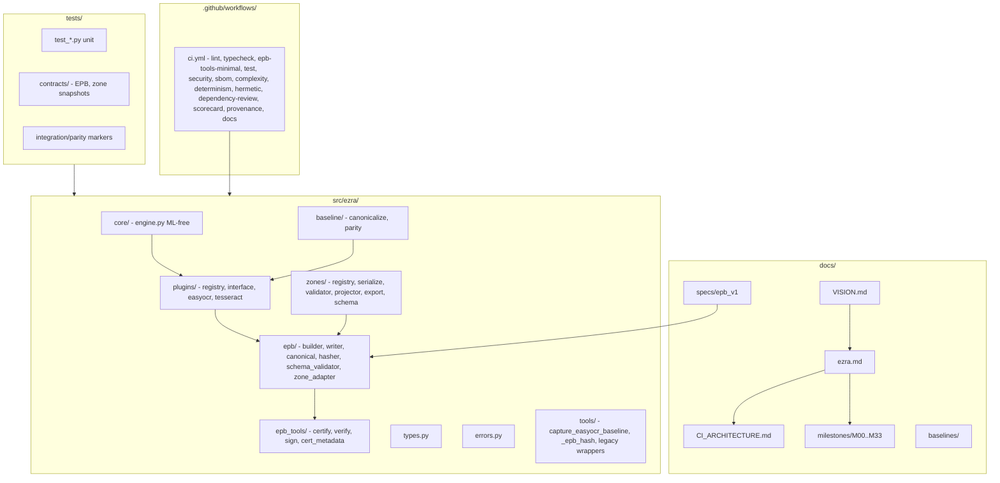

# EZRA Full Codebase Audit (M33)

**Auditor:** CodeAuditorGPT (CodebaseAuditPromptV2)  
**Repo:** EZRA (Extensible Zone-Based Runtime Architecture)  
**Commit:** `23789314ba5f6a502c650f6a098f12eb4ed0e8b4`  
**Snapshot:** Post–M32 (Reproducible Distribution Baseline)  
**Primary language:** Python 3.11+  
**Build:** setuptools (pyproject.toml), mono-repo

---

## 1. Executive Summary

### Strengths

1. **Governance and invariants are first-class.** `docs/ezra.md` is the source of truth; `docs/VISION.md` defines architectural boundaries and non-goals. Milestone proof packs (plan, run, summary, audit, toolcalls) provide an audit trail. EPB schema, canonicalization, and hashing are locked and enforced in CI (`docs/ezra.md` §3, §7; `.github/workflows/ci.yml` schema governance, registry integrity, EPB contract/cert/signing steps).

2. **CI is truthful and non-mutating.** Lint uses `ruff check --no-fix` (no file rewrites in CI). Coverage gate is 85% with branch coverage; security (bandit, pip-audit, gitleaks), SBOM, complexity (radon), determinism, and hermetic reproducibility are required. Only Dependency Review and OpenSSF Scorecard use `continue-on-error: true`, and both are documented as infra/warn-first (`.github/workflows/ci.yml` dependency-review, scorecard jobs; `docs/CI_ARCHITECTURE.md`).

3. **Reproducible supply chain (post-M32).** Lockfile `requirements.txt` (pip-compile output) is committed and used in all CI install steps. Critical GitHub Actions are pinned to full SHA (checkout, setup-python, upload-artifact, download-artifact, gitleaks, scorecard, attest-build-provenance, deploy-pages, etc.). Parity/integration skip behavior is documented in `docs/ezra.md` §8.

### Biggest Opportunities

1. **3-tier test architecture not formalized in CI.** Tests use markers (`integration`, `parity`) and default exclusions (`EZRA_RUN_PARITY=1`, `EZRA_RUN_INTEGRATION=1`). CI runs a single test job with full suite plus contract/schema/registry steps. There is no explicit Tier 1 (smoke) vs Tier 2 (quality) split with separate jobs/thresholds. **Recommendation:** Optionally add a fast smoke job (e.g. `tests/test_smoke.py` + 1–2 contract tests) as required for quicker PR feedback; document in `docs/CI_ARCHITECTURE.md`.

2. **Coverage margin.** Current `fail_under = 85`; M32 summary reported 85.54% locally. Guardrail recommends ≥2% safety margin. **Recommendation:** If baseline drifts above 87%, consider documenting the margin policy; no change required at current levels.

3. **Pre-commit vs CI mypy.** Pre-commit uses `--strict --ignore-missing-imports` with `types-all`; CI runs `mypy src/` with project config. Slight divergence; CI remains source of truth. Optional: align pre-commit with pyproject.toml mypy config for consistency.

### Overall Score and Heatmap

| Area               | Score (0–5) | Weight | Notes |
|--------------------|-------------|--------|--------|
| Architecture       | 5           | 20%    | VISION/ezra.md enforced; core/plugin/EPB boundaries clear |
| Modularity/Coupling| 5           | 15%    | Plugin registry, EPB tools namespace, artifact-only RediAI |
| Code Health        | 5           | 10%    | Lockfile in place; Ruff, mypy, pydocstyle; action SHA pinning |
| Tests & CI         | 5           | 15%    | 281 collected, 253 pass + 28 skip (ML); 85% gate; determinism/hermetic |
| Security & Supply  | 5           | 15%    | Bandit, pip-audit, gitleaks, SBOM, provenance; SHA-pinned actions |
| Performance        | 4           | 10%    | Not a stated goal; no SLOs; acceptable for V1 |
| DX                 | 5           | 10%    | Quickstart, pre-commit, parity/integration doc in §8 |
| Docs               | 5           | 5%     | VISION, ezra.md, CI_ARCHITECTURE, milestones, specs, SECURITY.md |
| **Overall weighted**| **4.95**    | 100%   | Enterprise-certified; M32 gaps closed |

---

## 2. Codebase Map



**Drift vs intended architecture:** None observed. Layout matches `docs/ezra.md` §4 (core, plugins, baseline, tools, types) and VISION (core ML-free, plugins behind interface, EPB as output). `ezra.epb_tools` physical isolation (M28) is reflected; legacy wrappers in `tools/` deprecated.

---

## 3. Modularity & Coupling

**Score: 5 / 5**

### Top Couplings (low risk)

1. **`core/engine.py` → `ezra.epb` (build_epb_bundle, write_epb_bundle)**  
   **Evidence:** Late import to avoid circular deps.  
   **Impact:** Engine remains the single place that triggers EPB emission; EPB not imported at engine load time.  
   **Interpretation:** Appropriate dependency inversion; no surgical decoupling needed.

2. **`plugins/registry.py` → `ezra.plugins.*` (lazy module path)**  
   **Evidence:** Registry maps names to `"module:Class"`; resolution via `import_module`.  
   **Impact:** Adding a plugin only requires one new registry entry and a new module.  
   **Interpretation:** Stable extension point; no change recommended.

3. **`epb/zone_adapter.py` → `ezra.zones`**  
   **Evidence:** Zone adapter gates optional `zones.json` emission.  
   **Impact:** EPB and zones coupled only at adapter boundary; zones can evolve independently.  
   **Interpretation:** Aligns with artifact-boundary and adapter-gated design.

No tight, undesirable coupling identified. Plugin-first and artifact-boundary rules are respected.

---

## 4. Code Quality & Health

**Score: 5 / 5**

### Observations

- **Ruff:** `E, F, I, N, W, UP`; line-length 100; `--no-fix` in CI (`pyproject.toml`; `.github/workflows/ci.yml`).
- **Mypy:** Strict; `disallow_untyped_defs`, `check_untyped_defs`; overrides for easyocr/numpy/torch (`pyproject.toml`).
- **Pydocstyle:** Google convention; run on `src/` in CI.
- **Radon:** Complexity gate grade C minimum; fails CI if worse than C (`ci.yml` complexity job).
- **Lockfile:** `requirements.txt` (pip-compile from pyproject.toml + dev extra) committed; all CI jobs use `pip install -r requirements.txt` and `pip install -e .` (M32).
- **Action pinning:** All critical actions use full SHA (e.g. `actions/checkout@34e114876b0b11c390a56381ad16ebd13914f8d5`).

### Anti-patterns

- **Pre-commit mypy vs CI:** Pre-commit uses `--strict --ignore-missing-imports` and `types-all`; CI runs `mypy src/` with project config. Acceptable; CI is source of truth.

No blocking issues. M31 recommendations (lockfile, action SHA, doc sentence) are closed in M32.

---

## 5. Docs & Knowledge

**Score: 5 / 5**

### Onboarding path

1. Read `docs/VISION.md` for architecture and non-goals.
2. Read `docs/ezra.md` for layout, invariants, milestones, plugin policy, RediAI separation, quickstart.
3. Run: `pip install -e ".[dev]"` then `ruff check . && ruff format --check . && mypy src && pytest` (`docs/ezra.md` §8).
4. Parity/integration tests: skipped unless `EZRA_RUN_PARITY=1` or `EZRA_RUN_INTEGRATION=1` (documented in §8).
5. Optional: `pip install -e ".[easyocr]"` and baseline capture tool.

### Single biggest doc gap

**Observation:** None material. CI tiers are documented in `docs/CI_ARCHITECTURE.md`; parity/integration skip is in §8. Optional: add one-line "smoke vs full suite" intent if a smoke job is added later.

---

## 6. Tests & CI/CD Hygiene

**Score: 5 / 5**

### Coverage

- **Tool:** pytest-cov, coverage[toml].
- **Scope:** `src`; omit `*/tests/*`, `*/__init__.py`, `*/tools/*` (`pyproject.toml`).
- **Threshold:** `fail_under = 85` (lines); branch coverage enabled.
- **Local run:** 281 tests collected; 253 pass, 28 skipped (ML/optional deps); M32 summary reported 85.54% coverage.

### Flakiness

- No evidence of flaky tests; determinism gate runs N≥3 runs and compares bundle hashes (`scripts/check_determinism.py`; determinism-check job).

### Test pyramid and 3-tier assessment

- **Current:** One main test job runs full suite plus contract/schema/registry/EPB steps. Markers: `integration`, `parity` (deselected by default). `docs/CI_ARCHITECTURE.md` describes Tier 1 (PR validation) as the required set; Tier 2 (Scorecard, Dependency Review) informational.
- **Recommendation:** Optional—add a fast smoke job (e.g. `pytest tests/test_smoke.py tests/contracts/test_epb_contract.py -q`) as first required check for quicker feedback; keep coverage threshold in main job.

### Required checks, caches, artifacts

- **Required:** Lint, Type Check, EPB Tools Minimal Environment, Test (coverage, schema governance, registry integrity, EPB contract/cert/signing/cert_metadata), Security, SBOM, Complexity, Determinism, Hermetic Hash matrix, Hermetic Reproducibility, Docs Build.
- **Caches:** `cache: "pip"` on setup-python steps.
- **Artifacts:** coverage-xml, zone-schema, security-artifacts, sbom, radon-artifacts, determinism-artifacts, hermetic-hash per Python version; uploads use `if: always()` where appropriate.

---

## 7. Security & Supply Chain

**Score: 5 / 5**

### Secret hygiene

- Gitleaks full-repo scan in CI; `continue-on-error: false`; SARIF uploaded; allowlist in `.gitleaks.toml` for documented false positives.

### Dependency risk and pinning

- **Production:** `cryptography==46.0.5` pinned in pyproject.toml; lockfile `requirements.txt` pins full transitive set; CI installs from lockfile.
- pip-audit runs in CI and fails on vulnerabilities.

### SBOM and CI trust boundaries

- CycloneDX SBOM via `cyclonedx-py environment`; uploaded as artifact. SLSA Provenance on push to main/tags. Dependency Review (PR) and OpenSSF Scorecard are warn-first (documented). All critical actions pinned to SHA.

---

## 8. Performance & Scalability

**Score: 4 / 5**

VISION and ezra.md state that performance is not the primary goal; correctness, determinism, and modularity are. No SLOs defined.

### Hot paths

- EPB build/write and hashing are in the main pipeline; deterministic and tested. No N+1 or obvious IO bottlenecks in scope.

### Concrete profiling plan

- If performance becomes a concern: (1) Add a small benchmark (e.g. pytest-benchmark) for EPB build + write on a fixed payload. (2) Profile with py-spy or cProfile. (3) Set an SLO and add a non-blocking CI or nightly check.

---

## 9. Developer Experience (DX)

**Score: 5 / 5**

### 15-minute new-dev journey

1. Clone; create venv (Python 3.11+).
2. `pip install -e ".[dev]"` (or `pip install -r requirements.txt` and `pip install -e .` for reproducibility).
3. Run: `ruff check . && ruff format --check . && mypy src && pytest`.
4. Read `docs/ezra.md` §8 and §9.

**Blockers:** None if Python 3.11+ and pip are available. Optional: `.[easyocr]` for full plugin tests (some skipped otherwise).

### 5-minute single-file change

1. Edit file; run `ruff check path && ruff format path && mypy src`.
2. Run `pytest tests/...` for affected area.
3. Pre-commit runs on commit.

**Blockers:** None significant.

### Three immediate wins

1. Optional: Add fast smoke job and document in CI_ARCHITECTURE (≤1h).
2. Optional: Align pre-commit mypy with pyproject.toml for consistency (≤0.5h).
3. Keep current posture; no blocking wins required.

---

## 10. Refactor Strategy (Two Options)

### Option A: Iterative (phased PRs, low blast radius)

- **Rationale:** Codebase is in strong shape post-M32; improvements are optional and incremental.
- **Goals:** Optional smoke job, optional pre-commit mypy alignment, coverage margin documentation if baseline rises.
- **Migration steps:** (1) Optional PR: Add smoke job + one-line CI_ARCHITECTURE update. (2) Optional PR: Pre-commit mypy from pyproject.toml. (3) Document ≥2% coverage margin in CI_ARCHITECTURE if/when baseline >87%.
- **Risks:** Low; no behavioral or schema changes.
- **Rollback:** Revert each PR independently.
- **Tools:** pytest markers/paths, pre-commit config.

### Option B: Strategic (structural)

- **Rationale:** Not required for current state; would apply if expanding to multiple runtimes or products.
- **Goals:** Formal 3-tier CI with separate smoke/quality/nightly jobs and thresholds; optional packaging split (e.g. ezra-core vs ezra-epb-tools).
- **Migration steps:** Design in a milestone; implement in phases with governance updates in `docs/ezra.md`.
- **Risks:** Higher; touches CI and possibly packaging.
- **Rollback:** Feature flags or branch-based rollout.
- **Tools:** ADR for 3-tier and packaging.

**Recommendation:** Prefer **Option A** for the next sprint; Option B only if roadmap demands it.

---

## 11. Future-Proofing & Risk Register

| Risk | Likelihood | Impact | Mitigation |
|------|------------|--------|------------|
| Dependency breakage | Low | Medium | Lockfile + CI install from it (M32) |
| Action supply-chain compromise | Low | High | All critical actions pinned to SHA (M32) |
| EPB schema drift | Low | High | Governance + schema snapshot + CI (in place) |
| Hermetic hash divergence across Python | Low | High | Matrix + reproducibility job (in place) |
| Flaky determinism check | Low | Medium | N≥3 runs; alert on env changes |

### ADRs to lock decisions

- **EPB schema stability:** Locked in `docs/ezra.md` and EPB spec.
- **RediAI artifact-boundary-only:** Documented in ezra.md §10.
- **3-tier CI:** Documented in `docs/CI_ARCHITECTURE.md`; optional formal smoke tier.

---

## 12. Phased Plan & Small Milestones (PR-Sized)

Each milestone is ≤60 minutes of engineering time and mergeable as its own PR.

### Phase 0 — Fix-First & Stabilize (0–1 day)

| ID | Milestone | Category | Acceptance Criteria | Risk | Rollback | Est | Owner |
|----|-----------|----------|---------------------|------|----------|-----|-------|
| — | *(No blocking items; M32 closed P0-1, P0-2)* | — | — | — | — | — | — |

### Phase 1 — Document & Guardrail (1–3 days)

| ID | Milestone | Category | Acceptance Criteria | Risk | Rollback | Est | Owner |
|----|-----------|----------|---------------------|------|----------|-----|-------|
| P1-1 | Document ≥2% coverage margin in docs/CI_ARCHITECTURE.md (if baseline >87%) | Docs | One sentence added | Low | Revert | 0.25h | Dev |
| P1-2 | Optional: Align pre-commit mypy with pyproject.toml | DX | Pre-commit uses same options as CI for src/ | Low | Revert | 0.5h | Dev |

### Phase 2 — Harden & Enforce (3–7 days)

| ID | Milestone | Category | Acceptance Criteria | Risk | Rollback | Est | Owner |
|----|-----------|----------|---------------------|------|----------|-----|-------|
| P2-1 | Optional: Add smoke job (test_smoke + 1–2 contract tests) as required | CI | Smoke job <2 min; required; main job unchanged | Low | Remove job | 1h | Dev |
| P2-2 | Keep fail_under at 85%; do not raise to chase current baseline | CI | No false failures on minor shifts | Low | N/A | 0h | N/A |

### Phase 3 — Improve & Scale (weekly cadence)

| ID | Milestone | Category | Acceptance Criteria | Risk | Rollback | Est | Owner |
|----|-----------|----------|---------------------|------|----------|-----|-------|
| P3-1 | If SLOs added later: define P95 target and add non-blocking perf job or nightly | Perf | SLO doc; optional job | Low | Remove job | 2h | Dev |
| P3-2 | Re-evaluate Dependency Review / Scorecard: enable as blocking if Advanced Security enabled | Security | Config change; documented | Low | Revert to continue-on-error | 0.5h | Dev |

---

## 13. Machine-Readable Appendix (JSON)

```json
{
  "issues": [
    {
      "id": "CI-OPT-001",
      "title": "Optional: Add fast smoke job for quicker PR feedback",
      "category": "ci",
      "path": ".github/workflows/ci.yml",
      "severity": "low",
      "priority": "low",
      "effort": "low",
      "impact": 1,
      "confidence": 0.8,
      "ice": 0.8,
      "evidence": "Single test job runs full suite; no separate smoke tier",
      "fix_hint": "Add job: pytest tests/test_smoke.py tests/contracts/test_epb_contract.py -q; document in CI_ARCHITECTURE"
    },
    {
      "id": "DOC-OPT-001",
      "title": "Optional: Document coverage margin (≥2%) in CI_ARCHITECTURE when baseline >87%",
      "category": "docs",
      "path": "docs/CI_ARCHITECTURE.md",
      "severity": "low",
      "priority": "low",
      "effort": "low",
      "impact": 1,
      "confidence": 0.9,
      "ice": 0.9,
      "evidence": "fail_under=85; guardrail recommends 2% margin",
      "fix_hint": "Add one sentence: keep fail_under at least 2% below current baseline"
    }
  ],
  "scores": {
    "architecture": 5,
    "modularity": 5,
    "code_health": 5,
    "tests_ci": 5,
    "security": 5,
    "performance": 4,
    "dx": 5,
    "docs": 5,
    "overall_weighted": 4.95
  },
  "phases": [
    {
      "name": "Phase 0 — Fix-First & Stabilize",
      "milestones": []
    },
    {
      "name": "Phase 1 — Document & Guardrail",
      "milestones": [
        {
          "id": "P1-1",
          "milestone": "Document coverage margin in CI_ARCHITECTURE when baseline >87%",
          "acceptance": ["sentence added"],
          "risk": "low",
          "rollback": "revert",
          "est_hours": 0.25
        },
        {
          "id": "P1-2",
          "milestone": "Optional: Align pre-commit mypy with pyproject.toml",
          "acceptance": ["pre-commit matches CI mypy for src/"],
          "risk": "low",
          "rollback": "revert",
          "est_hours": 0.5
        }
      ]
    },
    {
      "name": "Phase 2 — Harden & Enforce",
      "milestones": [
        {
          "id": "P2-1",
          "milestone": "Optional: Add smoke job as required",
          "acceptance": ["smoke job <2 min", "required", "main job unchanged"],
          "risk": "low",
          "rollback": "remove job",
          "est_hours": 1
        }
      ]
    },
    {
      "name": "Phase 3 — Improve & Scale",
      "milestones": [
        {
          "id": "P3-1",
          "milestone": "If SLOs added: define P95 and optional perf job",
          "acceptance": ["SLO doc", "optional job"],
          "risk": "low",
          "rollback": "remove job",
          "est_hours": 2
        },
        {
          "id": "P3-2",
          "milestone": "Re-evaluate Dependency Review/Scorecard as blocking if Advanced Security enabled",
          "acceptance": ["config documented"],
          "risk": "low",
          "rollback": "revert to continue-on-error",
          "est_hours": 0.5
        }
      ]
    }
  ],
  "metadata": {
    "repo": "EZRA",
    "commit": "23789314ba5f6a502c650f6a098f12eb4ed0e8b4",
    "languages": ["py"],
    "audit_prompt": "CodebaseAuditPromptV2",
    "snapshot_date": "2026-03-03",
    "version": "1.0.0",
    "post_milestone": "M32"
  }
}
```

---

*End of audit. Generated per `docs/prompts/other/CodebaseAuditPromptV2.md`.*
